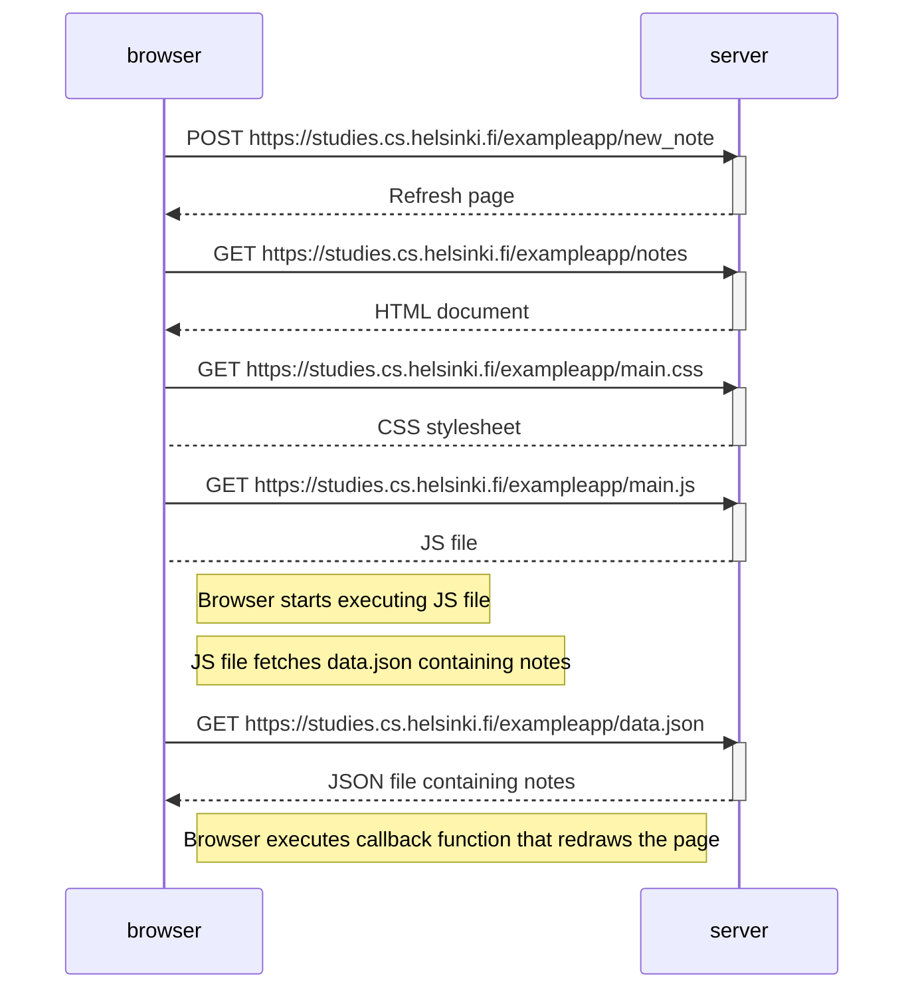

```mermaid
sequenceDiagram
  participant browser
  participant server

  browser ->> server: POST https://studies.cs.helsinki.fi/exampleapp/new_note
  activate server
  server -->> browser: Refresh page
  deactivate server

  browser ->> server: GET https://studies.cs.helsinki.fi/exampleapp/notes
  activate server
  server -->> browser: HTML document
  deactivate server

  browser ->> server: GET https://studies.cs.helsinki.fi/exampleapp/main.css
  activate server
  server --> browser: CSS stylesheet
  deactivate server

  browser ->> server: GET https://studies.cs.helsinki.fi/exampleapp/main.js
  activate server
  server --> browser: JS file
  deactivate server
  
  Note right of browser: Browser starts executing JS file
  Note right of browser: JS file fetches data.json containing notes

  browser ->> server: GET https://studies.cs.helsinki.fi/exampleapp/data.json
  activate server
  server -->> browser: JSON file containing notes
  deactivate server
  
  Note right of browser: Browser executes callback function that redraws the page
```
