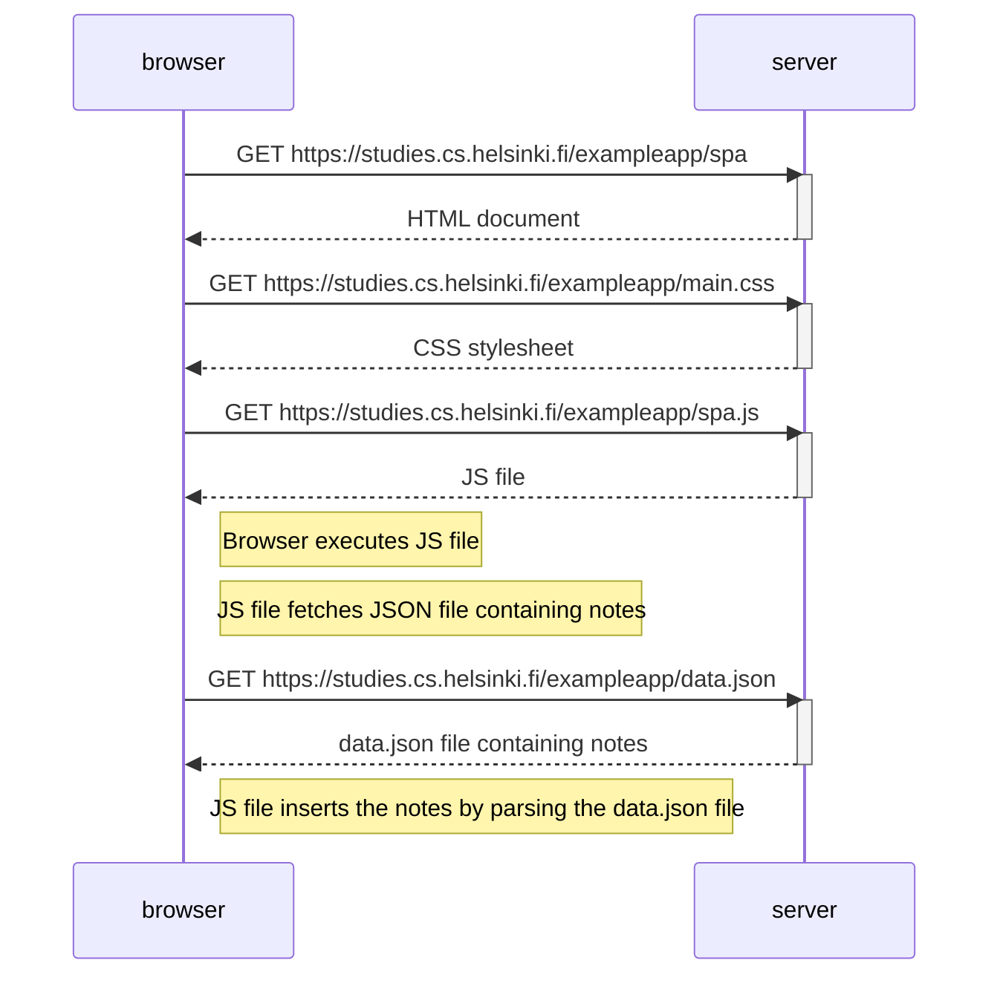

```mermaid
sequenceDiagram
  participant browser
  participant server
  
  browser ->> server: GET https://studies.cs.helsinki.fi/exampleapp/spa
  activate server
  server -->> browser: HTML document
  deactivate server

  browser ->> server: GET https://studies.cs.helsinki.fi/exampleapp/main.css
  activate server
  server -->> browser: CSS stylesheet
  deactivate server

  browser ->> server: GET https://studies.cs.helsinki.fi/exampleapp/spa.js
  activate server
  server -->> browser: JS file
  deactivate server

  Note right of browser: Browser executes JS file
  Note right of browser: JS file fetches JSON file containing notes

  browser ->> server: GET https://studies.cs.helsinki.fi/exampleapp/data.json
  activate server
  server -->> browser: data.json file containing notes
  deactivate server
  
  Note right of browser: JS file inserts the notes by parsing the data.json file
```
